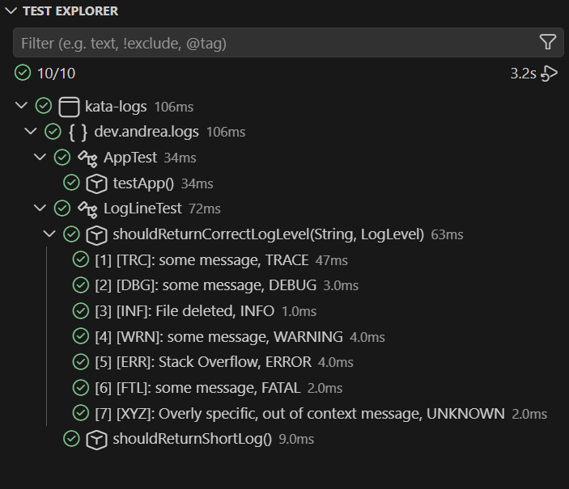
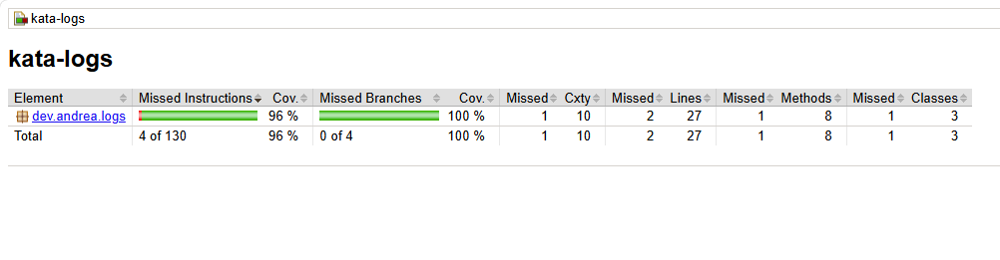

# Kata Logs

🔗 [Repositorio](https://github.com/AndreaVaGo/kata-logs)
🔗 [Ejercicio original en Exercism](https://exercism.org/tracks/java)

## 📋 Descripción del ejercicio

El objetivo es procesar líneas de log con el formato:

```
"[<LVL>]: <MESSAGE>"
```

Donde `<LVL>` es uno de estos códigos:

| Código | Nivel     |
|--------|-----------|
| `TRC`  | TRACE     |
| `DBG`  | DEBUG     |
| `INF`  | INFO      |
| `WRN`  | WARNING   |
| `ERR`  | ERROR     |
| `FTL`  | FATAL     |

### Tareas

**1. Parsear el nivel de log**

`LogLine.getLogLevel()` analiza la línea y devuelve el `LogLevel` correspondiente:

```java
var logLine = new LogLine("[INF]: File deleted");
logLine.getLogLevel();
// => LogLevel.INFO
```

**2. Soportar nivel de log desconocido**

Si el código no coincide con ninguno de los definidos, se añade el valor `UNKNOWN`:

```java
var logLine = new LogLine("[XYZ]: Overly specific, out of context message");
logLine.getLogLevel();
// => LogLevel.UNKNOWN
```

**3. Convertir la línea a formato corto**

`LogLine.getOutputForShortLog()` transforma la línea al formato `"<ENCODED_LEVEL>:<MESSAGE>"`, donde cada nivel tiene un valor numérico asociado:

| Nivel     | Valor codificado |
|-----------|-------------------|
| `UNKNOWN` | 0                 |
| `TRACE`   | 1                 |
| `DEBUG`   | 2                 |
| `INFO`    | 4                 |
| `WARNING` | 5                 |
| `ERROR`   | 6                 |
| `FATAL`   | 42                |

```java
var logLine = new LogLine("[ERR]: Stack Overflow");
logLine.getOutputForShortLog();
// => "6:Stack Overflow"
```

## 🎯 Diseño

- **`LogLevel`**: enum con 7 valores. Cada uno lleva dos campos asociados mediante constructor:
  - `code`: el código de 3 letras (`"TRC"`, `"INF"`, etc.)
  - `encodedValue`: el valor numérico para el formato corto

  Este patrón (enum + constructor + campos) sigue el mismo enfoque que otros enums del bootcamp (por ejemplo, `Emotion` en el proyecto Mi Diario).

- **`LogLine`**: envuelve el string original de la línea de log y expone:
  - `getLogLevel()`: recorre `LogLevel.values()` comparando el código extraído del string (con `substring` + `equals()`) contra el campo `code` de cada valor. Devuelve `UNKNOWN` si no hay coincidencia.
  - `getOutputForShortLog()`: reutiliza `getLogLevel()` para obtener el `encodedValue`, extrae el mensaje con `substring`, y concatena el resultado.

  **Nota de diseño:** se evitó deliberadamente el uso de `switch` para la búsqueda del nivel, resolviéndolo mediante iteración sobre los valores del enum en su lugar.

## 🧪 Testing & Coverage

- **Test parametrizado** (`@ParameterizedTest` + `@MethodSource`): cubre los 7 niveles de log (los 6 reales + `UNKNOWN`) en un único método, evitando repetir 7 tests casi idénticos.
- **Test específico** para `getOutputForShortLog()`, verificando el formato corto completo.

**10/10 tests en verde:**



**Cobertura (JaCoCo):**



> Reporte HTML completo disponible en `target/site/jacoco/index.html` tras ejecutar `mvn clean test`.

## ▶️ Cómo ejecutar los tests

```bash
mvn clean test
```

## 🛠️ Tecnologías

- Java 21
- Maven
- JUnit 5
- Hamcrest
- JaCoCo (cobertura de tests)

## 📦 Estructura del proyecto

```
kata-logs/
├── src/
│   ├── main/java/dev/andrea/logs/
│   │   ├── LogLevel.java
│   │   └── LogLine.java
│   └── test/java/dev/andrea/logs/
│       └── LogLineTest.java
├── assets/
│   └── tests-passing.png
├── pom.xml
└── README.md
```
